Java는 1995년, **James Gosling**이 Sun Microsystems에서 개발한 **객체 지향 프로그래밍 언어**입니다. 현재는 Oracle이 관리하며, **모바일(Android)**, **웹 서버**, **클라우드**, **게임**, **데스크탑 앱** 등 다양한 분야에서 여전히 활발하게 사용되고 있어요.

이 글에서는 Java의 기본 개념부터 [JDK](#java-development-kit), [JRE](#java-runtime-environment), [JVM](#java-virtual-machine), [Javac](#java-compiler), [Java Library](#java-library), [Class Loader](#class-loader)까지 **자바 생태계의 핵심 요소들**을 하나씩 정리해 보겠습니다.

## ☕ Java란?

Java는 **“한 번 작성하면, 어디서든 실행된다(Write Once, Run Anywhere)”**는 철학을 가진 **플랫폼 독립적인 언어**입니다.

개발자가 작성한 `.java` 파일은 `javac`를 통해 `.class` 바이트코드로 컴파일되고, 이 바이트코드는 **JVM 위에서 실행**됩니다.

## 🌟 Java의 주요 특징

|특징|설명|
|---|---|
|✅ 객체 지향|클래스와 객체 중심의 구조로 구성|
|✅ 플랫폼 독립|JVM이 설치된 어떤 OS에서도 실행 가능|
|✅ 자동 메모리 관리|**Garbage Collector**가 메모리 정리|
|✅ 풍부한 표준 라이브러리|`java.util`, `java.io`, `java.net` 등 제공|
|✅ 보안성|클래스 로더 및 런타임 검사로 보안 강화|
|✅ 멀티쓰레드 지원|멀티코어 환경에 최적화된 쓰레드 처리|

> 🙋‍♂️ 클래스 로더랑 보안성이랑 무슨 연관성이 있죠 ?
>
> 😶 자바의 **보안성은 클래스 로더에서 시작된다.**  
> **어디서 온 클래스인지**를 따져보고, **의심스러운 건 막고**, **신뢰된 것만 실행**하게 하는 것

| 키워드      | 쉬운 설명                                                   |
|-------------|-------------------------------------------------------------|
| 클래스 로더 | JVM 안의 **입국 심사대**. 클래스를 메모리에 올리기 전에 **검문**함. |
| 보안성      | "믿을 수 없는 코드"가 올라오는 걸 **차단**함. 출처 따라 **권한도 조절**함. |
| JVM         | "나라" 같은 존재. 클래스 로더를 통해 들어온 코드만 실행해줌. |


## 🔧  JDK (Java Development Kit) {#java-development-kit}

Java 애플리케이션을 **개발**할 수 있도록 도와주는 툴킷입니다.

**포함 구성:**

- JRE
    
- `javac`, `jar`, `javadoc`, `jdb` 등 개발 도구

> 💡 JAR(Java Archive) 파일은 여러개의 `.class` 파일과 리소스 파일 (이미지, 설정파일 등)을 하나로 묶 은  압축 파일 형식입니다.
> 
> 💡 javadoc은 자바 소스 코드에 작성된 주석을 기반으로 HTML문서(문서화된 API)를 자동 생성하는 도구 입니다.

👉 **개발자라면 JDK 설치는 필수!**

## 🎯 JRE (Java Runtime Environment) {#java-runtime-environment}

Java 프로그램을 **실행**하기 위한 최소 환경입니다.

**포함 구성:**

- JVM
    
- Java 표준 라이브러리(API)
    

💡 실행만 한다면 JRE만으로 충분하지만, 개발자라면 JDK를 설치해야 해요.

## 🚀 JVM (Java Virtual Machine) {#java-virtual-machine}

`.class` 바이트코드를 실행하는 **가상의 머신**입니다.

**JVM의 내부 구성:**

- 클래스 로더
    
- 실행 엔진
    
- 메모리 구조 (힙, 스택, 메소드 영역)
    
- GC (Garbage Collector)

**역할:**

- 바이트코드를 **OS 네이티브 코드로 변환**해 실행
    
- **플랫폼 독립성 보장** 핵심 요소

## 🛠️ Javac (Java 컴파일러) {#java-compiler}

Java 소스코드 `.java`를 바이트코드 `.class`로 **컴파일**하는 도구입니다.

```bash
javac HelloWorld.java
# → HelloWorld.class 생성
```

## 📚 Java 라이브러리 {#java-library}

Java에서 기본 제공하는 **표준 API 클래스 모음**입니다.

**대표 예시:**

- `String`, `Scanner`, `ArrayList`, `HashMap`, `Math`, `File`

**구조:**

- `java.*`, `javax.*`, `javafx.*` 패키지로 제공
    
- JRE에 포함되어 있어 따로 설치할 필요 없음

## 📥 클래스 로더 (Class Loader) {#class-loader}

`.class` 파일을 JVM 메모리로 **동적으로 로딩**하는 컴포넌트입니다.

**종류:**

- **Bootstrap ClassLoader** – Java 기본 클래스 로딩
    
- **Extension ClassLoader** – 확장 라이브러리 로딩
    
- **Application ClassLoader** – 애플리케이션 클래스 로딩
    

클래스 로더는 **보안성**과 **유연한 로딩 구조**를 지원해요.

**계층 구조**

```csharp
[Bootstrap ClassLoader]
        ↑
[Extension ClassLoader]
        ↑
[Application ClassLoader]

```

## 🌐 전체 흐름 요약

```mermaid
flowchart LR
    A[개발자 작성 - Hello.java] --> B[javac 컴파일] --> C[Hello.class 생성] --> D[클래스 로더] --> E[JVM 실행] --> F[OS에서 프로그램 실행]

```




## 🧩 포함 관계 비교

|구성 요소|포함 요소|
|---|---|
|JDK|JRE + `javac` + 개발 도구|
|JRE|JVM + Java 라이브러리|
|JVM|클래스 로더 + 실행 엔진 + GC|

## 📎 참고 자료

- [Oracle 공식 JDK 다운로드](https://www.oracle.com/java/technologies/javase-downloads.html)
    
- [Java SE API 문서](https://docs.oracle.com/en/java/javase/)
